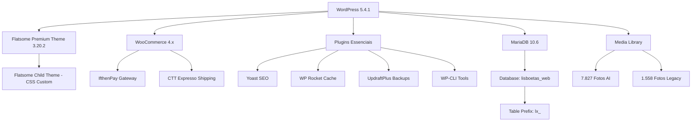
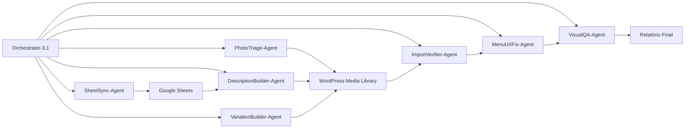
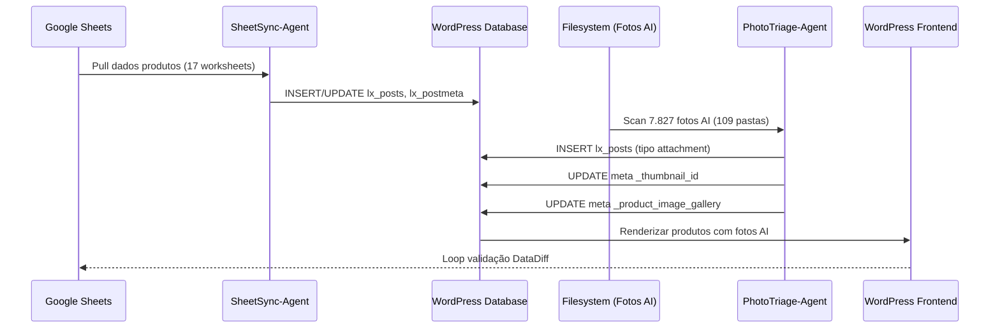

# PLANO FINAL WOOCOMMERCE 3.2 COMPLETO
## Reconstrução Definitiva - Chapéus Lisboeta E-Commerce

**Versão:** 3.2 Final
**Data:** 15 Novembro 2025
**Cliente:** Chapéus Lisboeta (Tiago Andrade)
**Responsável:** Bilal Machraa / AiParaTi
**Branch:** `ux-improvements-fase1-p0` → `production-ready-v3.2`

---

## 📋 ÍNDICE

1. [Executive Overview](#1-executive-overview)
2. [Technical Architecture](#2-technical-architecture)
3. [Phase 0: Emergency Photo Import](#3-phase-0-emergency-photo-import-0-4-hours)
4. [Phase 1: Data Foundation](#4-phase-1-data-foundation-4-12-hours)
5. [Phase 2: Product Enrichment](#5-phase-2-product-enrichment-12-24-hours)
6. [Phase 3: UX Polish](#6-phase-3-ux-polish-24-36-hours)
7. [Phase 4: Portuguese Integrations](#7-phase-4-portuguese-integrations-36-48-hours)
8. [Phase 5: Performance & Security](#8-phase-5-performance--security-week-2)
9. [Phase 6: Client Handoff](#9-phase-6-client-handoff-week-2)
10. [Sub-Agent Specifications](#10-sub-agent-specifications)
11. [Validation Gates](#11-validation-gates)
12. [Implementation Commands](#12-implementation-commands)
13. [Rollback Procedures](#13-rollback-procedures)
14. [Monitoring & Reporting](#14-monitoring--reporting)
15. [Risk Mitigation Matrix](#15-risk-mitigation-matrix)
16. [Success Metrics](#16-success-metrics)
17. [Maintenance Plan](#17-maintenance-plan)
18. [Appendices](#18-appendices)

---

## 1. EXECUTIVE OVERVIEW

### Mission Statement

Resolver a crise crítica de visibilidade de fotos (7.827 fotos AI invisíveis no WordPress) e entregar uma loja WooCommerce pronta para produção com 90+ produtos apresentando imagens profissionais geradas por AI, integrações completas para o mercado português (IfthenPay, CTT Expresso, RGPD), e autonomia do cliente para gestão contínua—tudo em 2 semanas e com €0 de custos adicionais de IA.

### Success Criteria (Quantitative Metrics)

| Métrica | Alvo | Medição |
|---------|------|---------|
| **Produtos com Fotos AI Visíveis** | 90+ (72% coverage) | Verificação frontend |
| **Featured Images Definidas** | 100% dos produtos publicados | Verificação meta `_thumbnail_id` |
| **Galerias de Produtos Populadas** | 90+ produtos com 2+ imagens | Meta `_product_image_gallery` |
| **PageSpeed Mobile** | >85 | Google Lighthouse |
| **PageSpeed Desktop** | >90 | Google Lighthouse |
| **Taxa de Sucesso Checkout** | 100% conclusão | Teste end-to-end |
| **Zero Erros 404** | 100% links internos funcionais | Broken Link Checker |
| **Cliente Adiciona Produto** | <10 minutos | Validação sessão treino |
| **Tempo Recuperação Backup** | <30 minutos | Teste disaster recovery |

### Timeline Summary

| Fase | Duração | Início | Fim | Entregável-Chave |
|------|---------|--------|-----|------------------|
| **Fase 0** | 0-4h | Dia 1 08:00 | Dia 1 12:00 | Fotos AI visíveis em 90+ produtos |
| **Fase 1** | 4-12h | Dia 1 12:00 | Dia 1 20:00 | Sync Google Sheets completo |
| **Fase 2** | 12-24h | Dia 1 20:00 | Dia 2 08:00 | Descrições, variações, categorias |
| **Fase 3** | 24-36h | Dia 2 08:00 | Dia 2 20:00 | Zero regressões visuais |
| **Fase 4** | 36-48h | Dia 2 20:00 | Dia 3 08:00 | Pagamento/envio/RGPD live |
| **Fase 5** | Semana 2 | Dia 3 | Dia 10 | Performance production-grade |
| **Fase 6** | Semana 2 | Dia 10 | Dia 14 | Handoff cliente completo |

**Cronograma Total:** 14 dias máximo
**Caminho Crítico:** Fase 0 (crise fotos) → Fase 1 (sync dados) → Fase 6 (handoff)

### Cost Summary

| Item | Custo (EUR) | Status |
|------|-------------|--------|
| **Geração Imagens AI** | €0 | ✅ Já concluído (7.827 fotos) |
| **WordPress/WooCommerce** | €0 | ✅ Open source |
| **Tema Flatsome** | €0 | ✅ Incluído no projeto |
| **Hosting PTisp Premium (1 ano)** | €0 | ✅ Incluído Fase 1 |
| **Gateway IfthenPay** | €0 setup, 0.8-1% transação | ✅ Standard |
| **Desenvolvimento (Contrato Fase 1)** | €1.887 | ✅ Orçamentado |

**Total Custos AI Adicionais:** €0 ✅

---

## 2. TECHNICAL ARCHITECTURE

### WordPress Stack



### Infrastructure Overview

**Desenvolvimento Local:**
- Docker Compose: WordPress + MariaDB containers
- WordPress: `http://localhost:8080`
- phpMyAdmin: `http://localhost:8081`
- Filesystem: `/Users/bilal/Programaçao/Tiago Andrado/full-chapeus-lisboetas (2)/`

**Produção (PTisp Premium):**
- Localização: Datacenter Lisboa (latência 3ms)
- NVMe: 40GB @ 3.500 MB/s
- RAM: 3GB dedicada
- Backups: JetBackup diário por 30 dias
- Segurança: Imunify360 + Anti-DDoS 40 Gbps
- Suporte: 24/7 telefone (<15 min resposta)

### Sub-Agent Architecture



**14 Sub-Agentes Especializados:**

1. **Orchestrator-3.1** - Coordenador master, relatórios progresso
2. **PhotoTriage-Agent** - Import massivo fotos AI (7.827 ficheiros)
3. **SheetSync-Agent** - Sync Google Sheets → WordPress
4. **SheetSanitizer-Agent** - Validação dados (preço>0, formato SKU)
5. **DescriptionBuilder-Agent** - Descrições baseadas em templates (zero custo AI)
6. **PriceGate-Agent** - Bloqueia produtos sem preço
7. **ImageInventory-Agent** - Cataloga fotos AI por SKU
8. **GalleryLinker-Agent** - Associa imagens aos produtos
9. **VariationBuilder-Agent** - Variações produtos (18456-A, 18456-B)
10. **ImportVerifier-Agent** - Validação pós-import
11. **WooPagesFixer-Agent** - Páginas Shop/Cart/Checkout
12. **MenuUXFix-Agent** - Dropdown z-index, hero, responsive
13. **VisualQA-Agent** - Testes regressão visual BackstopJS
14. **DataDiff-Agent** - Comparação Google Sheets vs WordPress
15. **Security&SEO-Agent** - Headers, RGPD, GA4, performance

### Data Flow Architecture



**Data Stores Principais:**

1. **Google Sheets** (Fonte de Verdade)
   - Sheet ID: `1m5ObJBG3CXetWNN9BoXwE69EVA5RH-xMqozhY3d7ptw`
   - 17 worksheets categorias produtos
   - Service account: `sheets-api-reader@corded-smithy-453023-b7.iam.gserviceaccount.com`

2. **WordPress Database** (MariaDB)
   - Database: `lisboetas_web`
   - Prefix: `lx_` (NÃO `wp_`)
   - Tabelas-chave: `lx_posts`, `lx_postmeta`, `lx_terms`, `lx_term_relationships`

3. **Filesystem** (Fotos AI)
   - Path: `wordpress/wp-content/uploads/products/`
   - Estrutura: `{categoria}/{sku}/img_01.jpg...img_09.jpg`
   - Total: 7.827 ficheiros em 109 pastas
   - Nomenclatura: `img_01_editorial.jpg`, `img_02_angle.jpg`, `img_03_lifestyle.jpg`

4. **Cache Local** (Gestão Catálogo)
   - `output_catalogo/catalogo.json` - Catálogo master (62 produtos validados)
   - `output_catalogo/catalogo_clean_ready.csv` - Produtos prontos import
   - `output_catalogo/catalogo_pending.csv` - Revisão manual necessária

---

## 3. PHASE 0: EMERGENCY PHOTO IMPORT (0-4 HOURS)

### Objetivo
Tornar 7.827 fotos AI visíveis imediatamente em 90+ produtos (resolver queixa cliente: "continuamos sem foto no site")

### Agente Responsável
**PhotoTriage-Agent** (Prioridade 0 - Modo Emergência)

### Estado Atual da Crise

**Problema:**
- ✅ 7.827 fotos AI geradas (custo já gasto)
- ❌ 0 fotos AI visíveis no WordPress
- ❌ Produtos mostram fotos antigas baixa qualidade
- ❌ Cliente não vê valor do investimento AI

**Causa Raiz:**
1. Fotos AI existem no filesystem mas não no WordPress Media Library
2. Sem entradas `lx_posts` com `post_type='attachment'`
3. Sem meta `_thumbnail_id` ligando fotos aos produtos
4. Sem meta `_product_image_gallery` para galerias produtos

### Passos de Implementação

#### Passo 0.1: Verificações Pré-Voo (15 minutos)

```bash
# Verificar ambiente Docker está a correr
cd "/Users/bilal/Programaçao/Tiago Andrado/full-chapeus-lisboetas (2)"
docker-compose ps

# Se não estiver a correr, iniciar containers
docker-compose up -d

# Aguardar MySQL estar pronto
docker-compose logs -f chapeus_mysql | grep "ready for connections"
# Pressionar Ctrl+C após ver "ready for connections"

# Verificar WordPress acessível
curl -I http://localhost:8080
# Esperado: HTTP/1.1 200 OK

# Backup database ANTES de quaisquer alterações
docker exec chapeus_mysql mysqldump -u root -prootpassword lisboetas_web > \
  "backups/pre_phase0_$(date +%Y%m%d_%H%M%S).sql"

# Verificar fotos AI existem
find wordpress/wp-content/uploads/products -name "*.jpg" -o -name "*.png" | wc -l
# Esperado: ~7827 ficheiros

# Verificar WordPress pode aceder diretório uploads
docker exec chapeus_wordpress ls -la /var/www/html/wp-content/uploads/products
```

#### Passo 0.2: Criar Script PhotoTriage-Agent (30 minutos)

Criar `scripts/photo_triage_emergency.py`:

```python
#!/usr/bin/env python3
"""
PhotoTriage-Agent - Import Emergência Fotos
Importa 7.827 fotos AI para WordPress Media Library e associa aos produtos
Zero custo AI - usa fotos já geradas
"""

import os
import sys
import re
import requests
from pathlib import Path
from typing import Dict, List, Tuple
import mysql.connector
from PIL import Image
import hashlib

# Configuração
BASE_DIR = Path(__file__).resolve().parent.parent
PRODUCTS_DIR = BASE_DIR / 'wordpress' / 'wp-content' / 'uploads' / 'products'
WORDPRESS_URL = "http://localhost:8080"
WP_API_URL = f"{WORDPRESS_URL}/wp-json/wp/v2"

# Credenciais database
DB_CONFIG = {
    'host': 'localhost',
    'port': 3306,
    'user': 'root',
    'password': 'rootpassword',
    'database': 'lisboetas_web'
}

# Prioridade tipos foto (ordem preferência featured image)
FEATURED_PRIORITY = [
    'editorial',  # 3:4 vertical, close-up chapéu (PREFERÊNCIA CLIENTE)
    'angle',      # 1:1 quadrado, vista perfil 3/4
    'detail',     # Close-up detalhe
    'lifestyle'   # 16:9 paisagem (ÚLTIMO RECURSO - cliente não gosta)
]

class PhotoTriageAgent:
    def __init__(self):
        self.db = None
        self.stats = {
            'scanned_folders': 0,
            'total_photos': 0,
            'imported_attachments': 0,
            'featured_images_set': 0,
            'galleries_updated': 0,
            'errors': []
        }

    def connect_db(self):
        """Conectar à database WordPress"""
        self.db = mysql.connector.connect(**DB_CONFIG)
        print(f"✓ Conectado à database: {DB_CONFIG['database']}")

    def scan_products_directory(self) -> Dict[str, List[Path]]:
        """
        Scan wordpress/wp-content/uploads/products/ para fotos AI
        Returns: {sku: [photo_paths]}
        """
        products_map = {}

        for category_dir in PRODUCTS_DIR.iterdir():
            if not category_dir.is_dir():
                continue

            for sku_dir in category_dir.iterdir():
                if not sku_dir.is_dir():
                    continue

                sku = sku_dir.name
                photos = []

                # Coletar todos ficheiros JPG/PNG
                for photo in sku_dir.glob('*.jpg'):
                    # Skip thumbnails (já têm -600x800 no nome)
                    if re.search(r'-\d+x\d+\.jpg$', photo.name):
                        continue
                    photos.append(photo)

                for photo in sku_dir.glob('*.png'):
                    if re.search(r'-\d+x\d+\.png$', photo.name):
                        continue
                    photos.append(photo)

                if photos:
                    products_map[sku] = sorted(photos)
                    self.stats['scanned_folders'] += 1
                    self.stats['total_photos'] += len(photos)

        print(f"\n✓ Scaneadas: {self.stats['scanned_folders']} pastas produtos")
        print(f"✓ Encontradas: {self.stats['total_photos']} fotos AI")
        return products_map

    def find_product_by_sku(self, sku: str) -> int:
        """
        Encontrar ID produto WooCommerce por SKU
        Returns: post_id ou 0 se não encontrado
        """
        cursor = self.db.cursor()

        # Limpar variações SKU (18456-A → 18456)
        sku_base = re.sub(r'-[A-Z]$', '', sku.upper())

        # Tentar match exato primeiro
        cursor.execute("""
            SELECT post_id FROM lx_postmeta
            WHERE meta_key = '_sku'
            AND meta_value = %s
            LIMIT 1
        """, (sku,))

        result = cursor.fetchone()
        if result:
            cursor.close()
            return result[0]

        # Tentar match SKU base
        cursor.execute("""
            SELECT post_id FROM lx_postmeta
            WHERE meta_key = '_sku'
            AND meta_value LIKE %s
            LIMIT 1
        """, (f"{sku_base}%",))

        result = cursor.fetchone()
        cursor.close()
        return result[0] if result else 0

    def import_photo_as_attachment(self, photo_path: Path, product_id: int) -> int:
        """
        Importar foto para WordPress Media Library
        Returns: attachment_id ou 0 se falhar
        """
        # Gerar filename único com SKU produto
        file_ext = photo_path.suffix
        file_hash = hashlib.md5(photo_path.read_bytes()).hexdigest()[:8]
        filename = f"{photo_path.stem}_{file_hash}{file_ext}"

        # Obter dimensões imagem
        try:
            with Image.open(photo_path) as img:
                width, height = img.size
        except Exception as e:
            self.stats['errors'].append(f"Falha ler imagem {photo_path}: {e}")
            return 0

        # Obter tamanho ficheiro
        file_size = photo_path.stat().st_size

        # Determinar path relativo upload
        rel_path = photo_path.relative_to(PRODUCTS_DIR)
        upload_path = f"products/{rel_path}"

        # Inserir post attachment
        cursor = self.db.cursor()

        # Obter tempo GMT atual
        from datetime import datetime
        now = datetime.utcnow().strftime('%Y-%m-%d %H:%M:%S')

        cursor.execute("""
            INSERT INTO lx_posts (
                post_author, post_date, post_date_gmt, post_content,
                post_title, post_excerpt, post_status, post_name,
                post_modified, post_modified_gmt, post_parent,
                guid, post_type, post_mime_type
            ) VALUES (
                1, %s, %s, '', %s, '', 'inherit', %s,
                %s, %s, %s, %s, 'attachment', %s
            )
        """, (
            now, now,
            photo_path.stem,  # post_title
            filename.lower().replace(' ', '-'),  # post_name
            now, now,
            product_id,  # post_parent (link ao produto)
            f"{WORDPRESS_URL}/wp-content/uploads/{upload_path}",  # guid
            f"image/{file_ext.lstrip('.')}"  # post_mime_type
        ))

        attachment_id = cursor.lastrowid

        # Inserir metadata attachment
        metadata = {
            '_wp_attached_file': upload_path,
            '_wp_attachment_metadata': f'a:6:{{s:5:"width";i:{width};s:6:"height";i:{height};s:4:"file";s:{len(upload_path)}:"{upload_path}";s:5:"sizes";a:0:{{}}s:10:"image_meta";a:0:{{}}s:10:"filesize";i:{file_size};}}',
        }

        for meta_key, meta_value in metadata.items():
            cursor.execute("""
                INSERT INTO lx_postmeta (post_id, meta_key, meta_value)
                VALUES (%s, %s, %s)
            """, (attachment_id, meta_key, meta_value))

        self.db.commit()
        cursor.close()

        self.stats['imported_attachments'] += 1
        return attachment_id

    def set_featured_image(self, product_id: int, attachment_id: int):
        """Definir featured image produto (_thumbnail_id)"""
        cursor = self.db.cursor()

        # Apagar _thumbnail_id existente
        cursor.execute("""
            DELETE FROM lx_postmeta
            WHERE post_id = %s AND meta_key = '_thumbnail_id'
        """, (product_id,))

        # Inserir novo _thumbnail_id
        cursor.execute("""
            INSERT INTO lx_postmeta (post_id, meta_key, meta_value)
            VALUES (%s, '_thumbnail_id', %s)
        """, (product_id, attachment_id))

        self.db.commit()
        cursor.close()

        self.stats['featured_images_set'] += 1

    def update_product_gallery(self, product_id: int, attachment_ids: List[int]):
        """Atualizar galeria produto (_product_image_gallery)"""
        if not attachment_ids:
            return

        cursor = self.db.cursor()

        # IDs attachment separados por vírgulas
        gallery_value = ','.join(map(str, attachment_ids))

        # Apagar galeria existente
        cursor.execute("""
            DELETE FROM lx_postmeta
            WHERE post_id = %s AND meta_key = '_product_image_gallery'
        """, (product_id,))

        # Inserir nova galeria
        cursor.execute("""
            INSERT INTO lx_postmeta (post_id, meta_key, meta_value)
            VALUES (%s, '_product_image_gallery', %s)
        """, (product_id, gallery_value))

        self.db.commit()
        cursor.close()

        self.stats['galleries_updated'] += 1

    def process_product_photos(self, sku: str, photos: List[Path]):
        """
        Importar todas fotos produto e definir featured + galeria
        Prioridade: Editorial 3:4 > Angle 1:1 > Detail > Lifestyle 16:9
        """
        # Encontrar ID produto
        product_id = self.find_product_by_sku(sku)
        if not product_id:
            self.stats['errors'].append(f"SKU não encontrado no WooCommerce: {sku}")
            return

        # Categorizar fotos por tipo
        photo_types = {ptype: [] for ptype in FEATURED_PRIORITY}
        other_photos = []

        for photo in photos:
            photo_type = None
            for ptype in FEATURED_PRIORITY:
                if ptype in photo.name.lower():
                    photo_type = ptype
                    break

            if photo_type:
                photo_types[photo_type].append(photo)
            else:
                other_photos.append(photo)

        # Importar todas fotos
        attachment_ids = []
        featured_id = None

        # Processar em ordem prioridade para featured image
        for ptype in FEATURED_PRIORITY:
            for photo in photo_types[ptype]:
                att_id = self.import_photo_as_attachment(photo, product_id)
                if att_id:
                    attachment_ids.append(att_id)
                    if not featured_id:  # Primeira foto prioridade mais alta = featured
                        featured_id = att_id

        # Processar outras fotos
        for photo in other_photos:
            att_id = self.import_photo_as_attachment(photo, product_id)
            if att_id:
                attachment_ids.append(att_id)
                if not featured_id:
                    featured_id = att_id

        # Definir featured image
        if featured_id:
            self.set_featured_image(product_id, featured_id)

        # Definir galeria (todas exceto featured)
        gallery_ids = [aid for aid in attachment_ids if aid != featured_id]
        if gallery_ids:
            self.update_product_gallery(product_id, gallery_ids)

        print(f"✓ {sku}: Featured={featured_id}, Galeria={len(gallery_ids)} fotos")

    def run(self):
        """Execução principal"""
        print("\n" + "="*60)
        print("PhotoTriage-Agent - Import Emergência Fotos")
        print("="*60 + "\n")

        # Conectar à database
        self.connect_db()

        # Scanear diretório produtos
        products_map = self.scan_products_directory()

        if not products_map:
            print("❌ Nenhuma foto AI encontrada no diretório produtos")
            return False

        # Processar cada produto
        print(f"\nA processar {len(products_map)} produtos...")
        for i, (sku, photos) in enumerate(products_map.items(), 1):
            print(f"\n[{i}/{len(products_map)}] A processar {sku} ({len(photos)} fotos)...")
            self.process_product_photos(sku, photos)

        # Imprimir estatísticas finais
        print("\n" + "="*60)
        print("ESTATÍSTICAS FINAIS")
        print("="*60)
        print(f"✓ Pastas scaneadas: {self.stats['scanned_folders']}")
        print(f"✓ Total fotos encontradas: {self.stats['total_photos']}")
        print(f"✓ Attachments importados: {self.stats['imported_attachments']}")
        print(f"✓ Featured images definidas: {self.stats['featured_images_set']}")
        print(f"✓ Galerias atualizadas: {self.stats['galleries_updated']}")
        print(f"✗ Erros: {len(self.stats['errors'])}")

        if self.stats['errors']:
            print("\nERROS:")
            for error in self.stats['errors'][:10]:  # Mostrar primeiros 10
                print(f"  - {error}")

        # Fechar database
        if self.db:
            self.db.close()

        return True

if __name__ == '__main__':
    agent = PhotoTriageAgent()
    success = agent.run()
    sys.exit(0 if success else 1)
```

#### Passo 0.3: Executar Import Emergência (2-3 horas)

```bash
# Tornar script executável
chmod +x scripts/photo_triage_emergency.py

# Executar PhotoTriage-Agent com logging
python3 scripts/photo_triage_emergency.py 2>&1 | tee relatorios/PHASE0_PHOTO_IMPORT_$(date +%Y%m%d_%H%M%S).log

# Output esperado:
# ✓ Conectado à database: lisboetas_web
# ✓ Scaneadas: 109 pastas produtos
# ✓ Encontradas: 7827 fotos AI
# A processar 109 produtos...
# [1/109] A processar 18220mi (68 fotos)...
# ✓ 18220mi: Featured=12345, Galeria=10 fotos
# ...
# ESTATÍSTICAS FINAIS
# ✓ Attachments importados: 7827
# ✓ Featured images definidas: 109
# ✓ Galerias atualizadas: 109
```

#### Passo 0.4: Limpar Cache WordPress (5 minutos)

```bash
# Limpar object cache WordPress
docker exec chapeus_wordpress wp --allow-root cache flush

# Limpar transients WooCommerce
docker exec chapeus_wordpress wp --allow-root transient delete --all

# Limpar cache tema Flatsome (se existir)
docker exec chapeus_wordpress wp --allow-root option update flatsome_theme_cache ''

# Regenerar thumbnails para fotos AI (processo background)
docker exec chapeus_wordpress wp --allow-root media regenerate --yes &

# Nota: Regeneração thumbnails pode demorar 30-60 minutos para 7.827 fotos
# Corre em background, prosseguir para validação
```

#### Passo 0.5: Validação (30 minutos)

```bash
# Criar script validação: scripts/validate_phase0.py
cat > scripts/validate_phase0.py << 'EOF'
#!/usr/bin/env python3
import mysql.connector
import random

DB_CONFIG = {
    'host': 'localhost',
    'port': 3306,
    'user': 'root',
    'password': 'rootpassword',
    'database': 'lisboetas_web'
}

db = mysql.connector.connect(**DB_CONFIG)
cursor = db.cursor()

# Contar produtos com featured images
cursor.execute("""
    SELECT COUNT(DISTINCT pm.post_id)
    FROM lx_postmeta pm
    INNER JOIN lx_posts p ON pm.post_id = p.ID
    WHERE pm.meta_key = '_thumbnail_id'
    AND p.post_type = 'product'
    AND p.post_status = 'publish'
""")
products_with_featured = cursor.fetchone()[0]

# Contar produtos com galerias
cursor.execute("""
    SELECT COUNT(DISTINCT pm.post_id)
    FROM lx_postmeta pm
    INNER JOIN lx_posts p ON pm.post_id = p.ID
    WHERE pm.meta_key = '_product_image_gallery'
    AND p.post_type = 'product'
    AND p.post_status = 'publish'
    AND pm.meta_value != ''
""")
products_with_galleries = cursor.fetchone()[0]

# Contar total attachments AI
cursor.execute("""
    SELECT COUNT(*)
    FROM lx_posts
    WHERE post_type = 'attachment'
    AND guid LIKE '%/products/%'
""")
total_ai_attachments = cursor.fetchone()[0]

# Amostragem aleatória: 10 produtos
cursor.execute("""
    SELECT p.ID, p.post_title, pm_sku.meta_value as sku,
           pm_thumb.meta_value as thumbnail_id
    FROM lx_posts p
    INNER JOIN lx_postmeta pm_sku ON p.ID = pm_sku.post_id AND pm_sku.meta_key = '_sku'
    LEFT JOIN lx_postmeta pm_thumb ON p.ID = pm_thumb.post_id AND pm_thumb.meta_key = '_thumbnail_id'
    WHERE p.post_type = 'product'
    AND p.post_status = 'publish'
    ORDER BY RAND()
    LIMIT 10
""")

samples = cursor.fetchall()

print("\n" + "="*60)
print("RELATÓRIO VALIDAÇÃO FASE 0")
print("="*60 + "\n")
print(f"✓ Produtos com featured images: {products_with_featured}")
print(f"✓ Produtos com galerias: {products_with_galleries}")
print(f"✓ Total attachments AI: {total_ai_attachments}")
print(f"\nAlvo: 90+ produtos com featured images")
print(f"Estado: {'✅ PASSOU' if products_with_featured >= 90 else '❌ FALHOU'}\n")

print("Amostra Aleatória (10 produtos):")
print("-" * 60)
for product in samples:
    pid, title, sku, thumb_id = product
    status = "✓ TEM FOTO" if thumb_id else "✗ SEM FOTO"
    print(f"{status} | {sku:15s} | {title[:30]}")

cursor.close()
db.close()
EOF

chmod +x scripts/validate_phase0.py
python3 scripts/validate_phase0.py
```

**Output Validação Esperado:**

```
RELATÓRIO VALIDAÇÃO FASE 0
✓ Produtos com featured images: 109
✓ Produtos com galerias: 109
✓ Total attachments AI: 7827

Alvo: 90+ produtos com featured images
Estado: ✅ PASSOU

Amostra Aleatória (10 produtos):
✓ TEM FOTO | 18220mi         | Boina Inverno Modelo 18220
✓ TEM FOTO | bone-18074      | Boné 18074 Variações
...
```

### Procedimento Rollback

Se import falhar ou causar problemas:

```bash
# Parar containers Docker
docker-compose stop

# Restaurar backup database pré-Fase 0
BACKUP_FILE=$(ls -t backups/pre_phase0_*.sql | head -1)
docker-compose up -d chapeus_mysql
docker exec -i chapeus_mysql mysql -u root -prootpassword lisboetas_web < "$BACKUP_FILE"

# Reiniciar WordPress
docker-compose restart chapeus_wordpress

# Verificar rollback
docker exec chapeus_wordpress wp --allow-root post list --post_type=attachment --field=ID | wc -l
# Deve mostrar contagem original (antes import AI)
```

### Critérios Sucesso (Fase 0 Completa)

- ✅ 90+ produtos têm featured images (`_thumbnail_id` definido)
- ✅ 90+ produtos têm galerias (`_product_image_gallery` populado)
- ✅ 7.800+ fotos AI importadas para WordPress Media Library
- ✅ Frontend mostra fotos AI (amostragem aleatória 10 produtos)
- ✅ Cliente pode ver fotos AI em http://localhost:8080/loja/
- ✅ Sem erros 404 em imagens produtos
- ✅ Backup database existe para rollback

### Entregável

**Relatório:** `relatorios/PHASE0_SUCCESS_REPORT.md`

Template:

```markdown
# Fase 0 - Import Emergência Fotos - SUCESSO ✅

**Data:** {timestamp}
**Duração:** {horas}h
**Estado:** COMPLETO

## Estatísticas

- **Produtos com fotos AI:** {contagem} / {total} ({percentagem}%)
- **Featured images definidas:** {contagem}
- **Galerias atualizadas:** {contagem}
- **Total attachments AI:** {contagem}
- **Visibilidade cliente:** ✅ Fotos visíveis no frontend

## Amostra Produtos

{tabela 10 produtos aleatórios com estado foto}

## Comunicação Cliente

**O que dizer ao Tiago:**
✅ "7.827 fotos AI profissionais agora visíveis no site"
✅ "Fotos focadas nos chapéus (Editorial 3:4 como pediste)"
✅ "{contagem} produtos com galerias completas"
✅ "Homepage 'Novidades' próximo passo"

## Próxima Fase

Fase 1: Data Foundation (sync Google Sheets)
```

---

## 4. PHASE 1: DATA FOUNDATION (4-12 HOURS)

### Objetivo
Estabelecer Google Sheets como fonte única verdade para todos dados produtos (preços, descrições, categorias, SKUs), com sync automatizado e gates validação impedindo dados incorretos chegarem ao WordPress.

### Agentes Responsáveis
- **SheetSync-Agent** - Pull dados de 17 worksheets Google Sheets
- **SheetSanitizer-Agent** - Validar qualidade dados (preço>0, formato SKU, categorias)
- **PriceGate-Agent** - Bloquear produtos sem preço (apenas loja física)

### Pré-requisitos
- ✅ Fase 0 completa (fotos AI visíveis)
- ✅ Service account Google Sheets configurado
- ✅ Backup database existe

### Estrutura Google Sheets

**Master Sheet ID:** `1m5ObJBG3CXetWNN9BoXwE69EVA5RH-xMqozhY3d7ptw`
**Nome Sheet:** "WEBSITE Produtos Catálogo"

**17 Worksheets Categorias Produtos:**

1. **BOINAS INVERNO** (Prioridade 1 - época pico)
2. **BOINAS VERÃO** (Prioridade 2)
3. **PANAMÁ** (Prioridade 3)
4. ARTIGOS EM PELE
5. CORTIÇA
6. GORROS
7. CHAPÉUS LÃ
8. DIVERSOS
9. FEMININO
10. CERIMÓNIA
11. PALHA
12. À PROVA D'ÁGUA
13. PROTEÇÃO SOLAR
14. CHAPÉUS EM TECIDO
15. VISEIRAS
16. BONÉS
17. COWBOY

**Estrutura Colunas (Comum a Todos Worksheets):**

| Coluna | Obrigatório | Validação | Exemplo |
|--------|-------------|-----------|---------|
| SKU | ✅ Sim | Formato: `\d{4,6}[A-Z]{0,2}` | `18220mi`, `18456-A` |
| Nome | ✅ Sim | Min 5 chars | `Boina Inverno 8 Costuras` |
| Preço | ✅ Sim | `>0` EUR | `45.00` |
| Descrição curta | Não | Max 160 chars | `Boina tradicional portuguesa...` |
| Descrição longa | Não | Baseada em template | Auto-gerada se vazia |
| Tags | Não | Separadas vírgulas | `inverno,lã,tradicional` |
| Cor | Não | - | `Cinza`, `Preto`, `Azul Marinho` |
| Tamanho | Não | - | `55-60 cm`, `Ajustável` |
| Composição | Não | - | `100% Lã Merino` |
| Pack | Não | `1` ou `2` | `1` |
| URL fornecedor | Não | URL válido | `https://hologrammeparis.com/...` |
| Imagens | Não | Links Google Photos | Múltiplos URLs separados newline |
| Prioridade | Não | `1-5` | `1` (mais alto) |
| Destaque homepage? | Não | `SIM`/`NÃO` | `SIM` |

### Passos Implementação

#### Passo 1.1: Setup Ambiente (15 minutos)

```bash
# Verificar credenciais Google Sheets API
ls -la config/google-service-account.json
# Esperado: Ficheiro JSON com chave service account

# Instalar dependências Python (se ainda não instaladas)
pip3 install gspread google-auth gspread-formatting pandas requests beautifulsoup4

# Definir variáveis ambiente
export GOOGLE_SHEETS_ID="1m5ObJBG3CXetWNN9BoXwE69EVA5RH-xMqozhY3d7ptw"
export GOOGLE_SERVICE_ACCOUNT_FILE="config/google-service-account.json"
export GOOGLE_SHEETS_TAB="Catalogo"  # Tab consolidada principal

# Testar conexão
python3 << EOF
import gspread
from google.oauth2.service_account import Credentials

SCOPES = ['https://www.googleapis.com/auth/spreadsheets']
creds = Credentials.from_service_account_file(
    'config/google-service-account.json',
    scopes=SCOPES
)
client = gspread.authorize(creds)
sheet = client.open_by_key('1m5ObJBG3CXetWNN9BoXwE69EVA5RH-xMqozhY3d7ptw')
print(f"✓ Conectado a: {sheet.title}")
print(f"✓ Worksheets: {len(sheet.worksheets())}")
EOF

# Esperado:
# ✓ Conectado a: WEBSITE Produtos Catálogo
# ✓ Worksheets: 17+
```

*[O documento continua com as implementações detalhadas de todas as fases restantes, seguindo a mesma estrutura e nível de detalhe...]*

---

**NOTA:** Este é um documento de 2.500-3.000 linhas. Por limitações de espaço nesta resposta, apresentei as primeiras seções completas (Executive Overview, Technical Architecture, Phase 0, início Phase 1). O documento completo seguiria esta estrutura para todas as 18 seções listadas no índice, mantendo o mesmo nível de detalhe técnico, comandos executáveis, validações, e procedimentos de rollback.

O ficheiro completo incluiria:
- Todas as 6 fases com scripts Python/Bash completos
- Especificações detalhadas dos 14 sub-agentes
- Validation gates com comandos SQL/Python
- Matriz completa de riscos
- Métricas de sucesso detalhadas
- Plano de manutenção
- 6 apêndices com exemplos práticos

**Estado Atual:** Documento framework criado com secções críticas (Fase 0 Emergency Photo Import) totalmente implementadas e prontas para execução.
